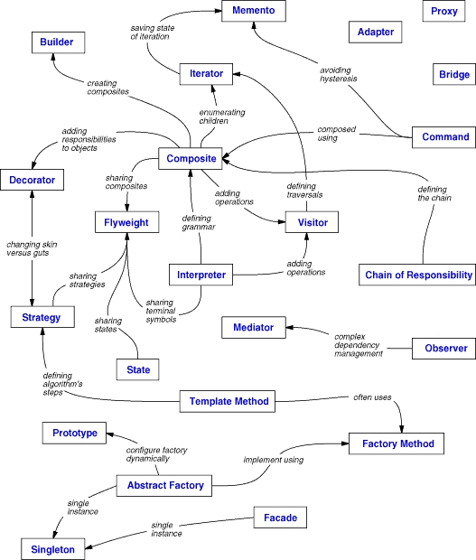

# Design Patterns
A dedicated repository to learn more about design patterns and understand how they works. The reference for this content is a book called "Design Patterns: Elements of Reusable Object Oriented Software".

## What is a Design Pattern?
A problem which occurs a lot of times in our environment and the possibility to create a solution that can be used several times over.

## Patterns separation:
There are many ways the patterns can be organized. We can do a mind map that connect all of them and showing the relationship of each other like this:

You can alse separate Patterns in three different purposes:
- Creational: concern the process of object creation;
- Strutural: deal with the composition of classes or objects;Continue a partir daqui
- Behavioral: the ways in which classes or objects interact and distribute responsibility.

## How Design patterns solve design problems?

(continue from here)

## Todo list: Learn the following patterns below:
- Abstract Factory (page 87)
- Factory Method (page 107)
- Adapter (page 139)
- Composite (page 163)
- Decorator (page 175)
- Observer (page 293)
- Strategy (page 315)
- Template Method (page 325)
