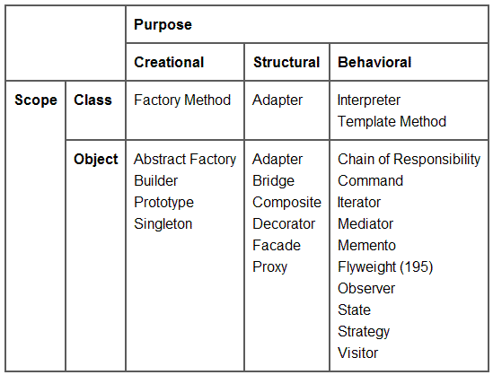

# Design Patterns
A dedicated repository to learn more about design patterns and understand how they works. The reference for this content is a book called "Design Patterns: Elements of Reusable Object Oriented Software".

## What is a design pattern?
A problem which occurs a lot of times in our environment and the possibility to create a solution that can be used several times over.

## Patterns separation:
There are many ways the patterns can be separated. We can do a mind map that connect all of them showing the relationship of each other like this:

And you can also separate patterns in three different purposes:
- Creational: concern the process of object creation;
- Strutural: deal with the composition of classes or objects;
- Behavioral: the ways in which classes or objects interact and distribute responsibility.

## How design patterns solve design problems?
 - Determining Object Granularity: Some design patterns can help us to represent things only with objects. It is important because sometimes we don't know exactly how to ideally separate(The Facade), create(Factory and Builder), suport huge number of them(Flyweight) and interact with them(Visitor and Command).

## Todo list: Learn the following patterns below:
- Abstract Factory (page 87)
- Factory Method (page 107)
- Adapter (page 139)
- Composite (page 163)
- Decorator (page 175)
- Observer (page 293)
- Strategy (page 315)
- Template Method (page 325)
